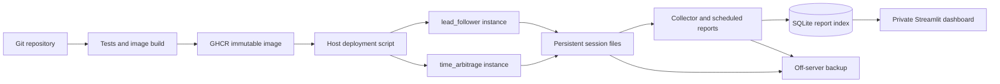

# Polytrader: single-server bot deployment and research dashboard

Plan dated 5 October 2026. Repository implementation is now available; follow the
[operations guide](bot_operations.md) for setup, commands and verification limits.
Host provisioning and live deployment remain operator setup. Scope: private,
single-user research, paper trading and read-only opportunity detection.

## Recommended stack

| Component | Choice | Purpose |
|---|---|---|
| Server | One Linux VPS with persistent SSD | Always-on subscriptions and storage |
| Processes | Docker Compose, one container per bot instance | Independent configuration, restarts and releases |
| Dashboard | Streamlit, Python only | Status, charts, candidate filters and downloadable reports |
| Report index | SQLite on local disk; one collector writes | Fast queries without repeatedly reading huge JSONL files |
| Research artifacts | Existing JSON/JSONL, rotated and compressed | Preserve detailed evidence and replay |
| Deployment | GitHub Actions + GHCR + restricted SSH deployment script | Test, build, publish and deploy a selected release |
| Private access | Tailscale Serve | Reach the dashboard from approved personal devices |
| Backup | Nightly upload to an off-server S3-compatible bucket | Recovery after losing the VPS |

Start with an estimated 2 vCPU / 4 GB RAM and 40–80 GB SSD. This is a sizing starting
point, not a measured requirement. Measure CPU, memory and recorded bytes per hour
with the actual subscriptions before committing to retention guarantees. Providers
remain interchangeable. If the repository is not on GitHub, initially run the same
deployment script manually; GitHub hosting is a proposed prerequisite for Actions.

Compose supports single-server deployment and restart policies; Docker's `local`
logging driver provides rotating console logs. This does not rotate application
JSONL files, which need separate handling. Sources: [Compose deployment](https://docs.docker.com/compose/how-tos/production/),
[local logging driver](https://docs.docker.com/engine/logging/drivers/local/).

Streamlit fits this Python codebase and can refresh dashboard fragments periodically
while a browser session is active. Data collection and daily report generation must
run in the collector independently of whether anyone opens the dashboard.
[Streamlit fragments](https://docs.streamlit.io/develop/api-reference/execution-flow/st.fragment).

SQLite WAL supports readers alongside a writer on the same host. Keep it on a
local host volume, use one writer, short read transactions and tested permissions
for its WAL/shared-memory files; do not put the live database in object storage or
on a network filesystem. [SQLite WAL documentation](https://www.sqlite.org/wal.html).

## Architecture



Use the same tested Polytrader worker image with different module/config arguments.
Give each instance a stable name, such as `lead-follower-ukraine`, and its own output
directory. A new process creates a new run/session ID. Pin images by digest, not
mutable `latest`, and record the Git SHA, config hash and strategy version per run.
Dashboard/collector dependencies belong in an optional `ops` extra or separate image;
keep the core strategy package lightweight.

The dashboard gets read-only application data access and no Docker socket. In the
first release, users deploy/start/stop instances through a GitHub workflow or host
script. Link to that workflow from the dashboard. Native dashboard management buttons
can follow later using a small authenticated, allowlisted controller; avoid building
a custom process orchestrator to get the first version running.

## Fit with the existing repository

Both bots already have module CLIs, TOML configuration and session directories.
`lead_follower` writes `metadata.json`, `events.jsonl`, `inputs.jsonl`, and a final
`summary.json`. `time_arbitrage` writes `manifest.json`, lifecycle events and its own
summary format; it already emits periodic `health_summary` events.

Add adapters for those formats instead of rewriting either strategy engine. Preserve
existing session readers and v1/v2 replay semantics. Build the first dashboard from
existing local runs before deploying a server.

Suggested additions:

```text
deploy/
  Dockerfile
  compose.yaml
  instances.example.toml
  deploy.sh
src/polytrader/ops/
  collector.py
  adapters/lead_follower.py
  adapters/time_arbitrage.py
  reports.py
  dashboard.py
  storage.py
.github/workflows/
  test-build.yaml
  deploy.yaml
tests/test_ops_*.py
```

Keep strategy-specific reporting in each bot. Introduce shared runtime/file helpers
only for common status, shutdown and rotation behavior.

## Dashboard and reporting

First screens:

1. **Overview:** configured instances, current run/version, process heartbeat,
   transport health, warm-up state, healthy observation hours, errors, storage usage
   and latest report time. Show quiet markets as healthy when transport is alive.
2. **Instance detail:** selected contracts, config, recent lifecycle events, rejected
   candidates with reasons, open paper positions or active quoted opportunities.
3. **Research results:** filters by instance, strategy version, config hash, market
   and date; daily trends and downloadable CSV/JSON/HTML summaries.
4. **Runs and artifacts:** run history, interruptions, deployment changes, replay
   coverage and links to bounded log extracts or report downloads.

Keep economics separate:

- `lead_follower`: closed hypothetical P&L, wins/losses, unresolved positions,
  holding times, candidate counts and rejection reasons; label fees excluded.
- `time_arbitrage`: observed opportunity episodes, duration, quoted size and estimated
  edge/profit under its fee assumptions. These are not realized or paper-position
  P&L. Overlapping opportunities may share liquidity and must not be summed as
  executable portfolio profit.

Do not mix results across changed strategy/config versions without an explicit
comparison. Distinguish correlated candidate updates from independent trades.
Store UTC, display Europe/London by default, and record the timezone/date boundaries
used for daily reports, including daylight-saving changes.

## Storage and reliability changes

### Status and summaries

Write an atomic lightweight `status.json` every 10 seconds and a current summary
every minute. Include process liveness, transport state, continuity/reconnect count,
data-writing status and warm-up separately from market activity. Expose unavailable
book counts separately: a connected feed can still be unable to qualify entries.

The collector periodically reads status/summaries and incrementally indexes events.
Persist byte offsets and a uniqueness key `(instance_id, run_id, segment, record_offset)`
transactionally so restarts do not double-count records. Defer partial trailing lines;
surface malformed complete records. Preserve Decimal amounts as decimal strings or
explicitly scaled integers, not floating-point financial totals.

SQLite is a rebuildable reporting index; session files remain the source evidence.
Index lifecycle/candidate events and useful aggregates, not every depth update.
Show collector lag on the dashboard. Collector/dashboard failure must not stop bots.

### Rotation, retention and backup

Rotate closed application segments by time/size, compress them and maintain a manifest
with ordering, schema versions and checksums. Adapt replay to read both old single
files and the new segmented format. Never use external copy/truncate on active JSONL.
For independently downloadable replay chunks, include a full book-state checkpoint;
otherwise declare all required predecessor segments and retain the complete chain.

Initial retention targets, subject to measured volume: 7 days of raw replay inputs,
90 days of events, and long-term daily reports/config manifests. Pin interesting
sessions for longer retention. Back up retained closed segments and reports nightly;
use SQLite's backup API for a consistent database snapshot. Verify a restore. Local
retention is not a backup, and raw data expired under policy is no longer replayable.

The lead/follower runner currently records timer observations about ten times per
second, even when markets are quiet. Measure this overhead before changing it:
compress repetitive records or redesign timer replay deterministically, rather than
silently dropping observations that affect simulated entry/exit timing.

Disk-pressure policy: warn before the high-water mark, prune only expired closed
artifacts, then stop safely if durable logging cannot continue. Do not keep producing
apparently valid research results after losing the ability to record evidence.

### Shutdown, restarts and health

Add Linux SIGTERM handling and a Compose stop grace period so deployments close
writers and produce final summaries. On crashes, keep the last atomic position/status
checkpoint and mark that run interrupted. In the first release, retain unfinished
positions as unresolved/censored in the old run and warm up a fresh run; do not
pretend they closed profitably or carry stale books/monotonic times across processes.
Full position continuation can be added explicitly later.

Restart crashed containers and start them on host boot. Docker health status alone
does not restart a hung container: add a small host watchdog for expired process
heartbeats, or first ship with alerts and manual recovery. A process heartbeat must
not be based on the last market trade/update. Quiet healthy feeds stay connected.
Alert on process failure, persistent reconnecting, collector lag, disk pressure and
backup failure. An external uptime check is needed to detect failure of the whole VPS.

## Deployment workflow and adding bots

1. Add/change a strategy and its tests, or create a named instance with a reviewed
   TOML config. Instance definitions map an allowlisted strategy to config/output
   paths; they do not accept arbitrary shell commands.
2. CI runs offline tests and builds a reproducible Linux image with pinned deployment
   dependencies. Publish the commit-tagged image to GHCR. [GitHub image publishing](https://docs.github.com/en/actions/tutorials/publish-packages/publish-docker-images).
3. Run the deployment workflow with instance name and release digest. The host script
   locks deployment, validates config and public discovery, saves the previous
   image/config pair, pulls the release and recreates only the chosen instance.
4. Check process heartbeat, readable output and connection state with a bounded startup
   check. No-trade periods are not failed deployment checks. Preserve diagnostics and
   roll back startup failures; use explicit handling for external API outages.
5. Rollback restores the prior image and config together. Keep data volumes and both
   runs; prevent simultaneous duplicate copies of the same logical instance.

Use a manual workflow trigger first; deployment after merging a release can be
enabled once the restart/rollback behavior has been exercised. GitHub credentials
stay outside the dashboard. A host deploy account uses a constrained script, not a
general web-exposed Docker API. Bind the UI locally and expose it through private
[Tailscale Serve](https://tailscale.com/docs/reference/tailscale-cli/serve).

A new strategy needs a CLI/config validator, status/summary contract and a reporting
adapter. A new instance of an existing strategy should require only configuration
and a deploy action, not changes to the dashboard.

## Implementation sequence and acceptance checks

| Phase | Deliverable | Done when |
|---|---|---|
| 1: local visibility | Collector, SQLite adapters, Streamlit screens | Existing runs from both bots render correctly; repeat ingestion is idempotent; financial metrics stay separate |
| 2: unattended runtime | Status/current summaries, SIGTERM, checkpoints, segmented logs, retention | Quiet feeds remain healthy; forced stop/crash is visible; replay survives rotation; disk behavior is tested |
| 3: one-server release | Compose, private access, CI image and deploy script | Two bots run independently; a new named instance can be deployed; reboot and rollback preserve data |
| 4: research operations | Daily reports, backup/restore, notifications | Reports appear without a browser open; restore works; missing collection is visible |

Keep the first deployment small: two strategy types, a few reviewed families and one
user. Defer React/FastAPI, Redis/Celery, Kubernetes, Prometheus/Loki/Grafana and a
multi-server database until a concrete need appears. Add a native dashboard control
API only if config-and-workflow deployment becomes a genuine usability bottleneck.

No provider, server account, domain, bucket or notification destination has been
selected or provisioned by this plan. Choose those when implementation reaches
deployment; the local reporting work can start without them.
